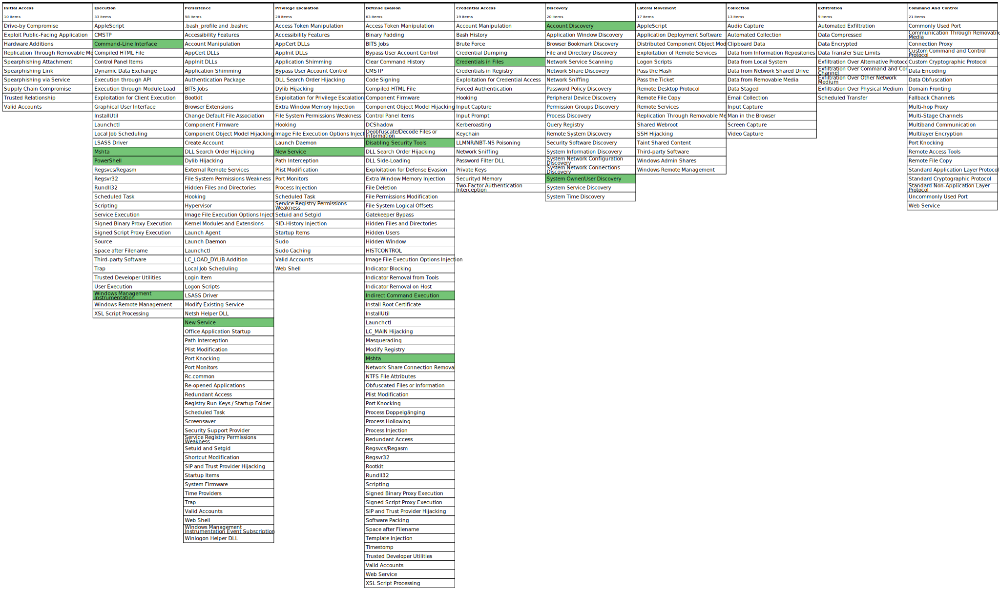

# ossec-sysmon

## A Ruleset to enhance detection capabilities of Ossec using Sysmon

See the following post to see how this ruleset can help you detect Emotet and other malicious document malware.

https://laskowski-tech.com/2018/11/28/detecting-emotet-and-other-downloader-malware-with-ossec-wazuh/

The 0805-sysmon-modular rules map to the Sysmon configuration by olafhartong and are tagged to the MITRE ATT&CK framework.
You can find that at the following link.

https://github.com/olafhartong/sysmon-modular
